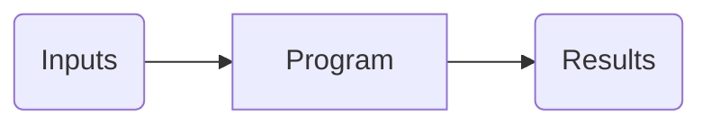
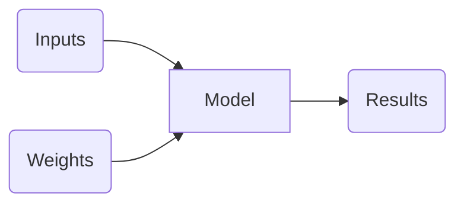
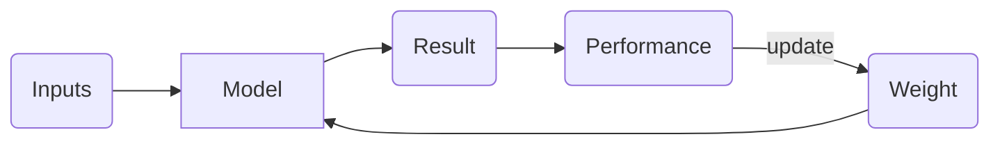
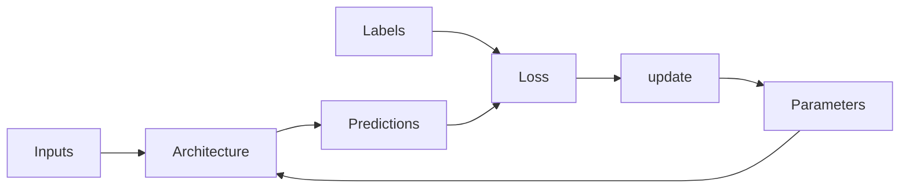

---

title: Practical Deep Learning for Coders Intro

toc: true

use_math: true

categories:

 - Deep Learning

---

## 머신러닝은 무엇인가?

머신러닝은 일반적인 프로그래밍과 같이 컴퓨터가 특정 작업을 완성하는 방법을 알아내는 것이다. 그런데 일반적인 프로그래밍으로 우리가 이전에 강아지,고양이 분류기를 구현한 것처럼 어떻게 구현해야 하나? 아래에서 컴퓨터가 작업을 **완성**하기위해 필요한 스텝들을 적어놓겠다.



보통 우리가 프로그램을 구현할 때, 위와 같이 절차를 적어놓고 구체적은 구현 단계에서 코드를 짜는 것이 아래와 같지만, **사진**을 구별할때는 별 도움이 되지는 않는다. 그렇다면 어떠한 방식으로 사진을 구별해야 정확하게 구현해낼까?



첫번째 스텝 : 아이디어는 컴퓨터에게 **정확한 과정**을 알려주기 보다는 **문제를 푸는 예시**를 보여주고 스스로 어떻게 푸는지 알려주는 것이며, 이러한 아이디어의 모델은 위의 그래프와 같이 구현된다. 즉,  출력을 입력에만 기반하지 않고 **가중치**도 함께 고려하여 값을 낸다는 것이다. 이는 다시말하면 **가중치**로부터 이전의 **경험**을 토대로 다시 **학습**을 한다는 것이다. 



두번째 스텝 : 결과에서 지던 이기던 결과를 출력할 것이고, 결과값을 이용해 퍼포먼스를 평가한다. 퍼포먼스 평가값을 바탕으로 **가중치값을 갱신**한다. 이것이 두 번째 스텝의 핵심 개념이다.

### 마지막 다이어그램에서 무엇을 알아낼 수 있을까?

이것을 바탕으로, 우리는 머신러닝이 수동적으로 코딩(규칙을 상세히 정의하여 컴퓨터에게 알려주는 것)이 아닌 이전의 경험으로부터 컴퓨터가 학습하게 하도록 만드는 방법임을 알게 되었다. 그렇다면 이것을 이미지 인식에 어떻게 사용이 가능하게 하는 것은 무엇이며, **모델**과 **가중치값**들이 고양이와 강아지를 어떻게 더 잘 구별하게 만들까? 우리가 구해야하는 것은 앞서 말한 그대로에서 **가중치 값들이 모델 안에서 모든 것을 하게 만들면 된다.** 

놀랍게도, 우리는 이러한 모델이 존재한다는 것을 알고 있고 **Neural Network**가 어떠한 문제도 해결할 열쇠라는 것을 알고 있다. 이는 **Universal Approximation Theorem**에 의해 증명이 가능하며, 이 이론은 1개의 Hidden Layer을 가진 Neural Network를 이용한다면 어떠한 함수도 근사시킬 수 있다는 이론이다. 

앞선 모델과 모델의 매개변수인 가중치값의 연관성을 안다. 따라서 우리는 Neural Network에 대해 **매개변수화**된 가중치값을 조정만 한다면, 어떠한 함수에 근사시킬 수 있다(극단적으로 말해 세계에 있는 모든 강아지와 고양이 사진을 분류할 수 있는 함수에 근사시킬 수 있다)는 사실을 알 수 있다.

### 마지막 다이어그램에서 Update란 무엇일까? 

우리가 알맞은 모델(특정 문제를 해결할 수 있는 모델의 매개변수를 찾기 위해)을 찾기 위해 모델(수식)의 가중치(매개변수)를 조정해야 할 필요가 생긴다. 이는 위의 다이어그램에서 **Update**과정이며 대표적으로 SGD(경사 하강법)의 방식이 존재한다. 

### 현대에서 사용하는 딥러닝 모델



초기에 사용했던 모델과는 다른 그래프지만, 공유하는 개념은 같다.

- Architecture : Parameters를 조정하여 우리가 얻어내고자 하는 **목적**을 달성할 함수이다. (Model -> Architecture)
- Parameters : 우리가 앞서 말한 Weight지만, weight는 Parameter의 한 종류이다.
- Predictions : Inputs(**Independent variable**)으로부터 계산결과로 나온 나온 결과값(results)이다.
- Loss : Labels(**Dependent variable**s)과 Predictions(**Independent variables**)에 기초하여 값이 결정된다. 

현대 사용하는 머신러닝 모델의 특징을 알아보았으며, 더 나아가 실생활에서 어떻게 모델을 적용할 수 있는지 알아보자.

- 범죄 예측 모델 : 과거 어느 지역에서 체포가 일어났었는지(**Labels**에 해당됨)를 근거로 만들어진 모델이다.  범죄를 예측하는 것 보다는 체포를 예측하는 것이며 단순히 현재 존재하는 순찰 과정에 편향을 반영하는 것이다. 따라서 어느 지역에서 경찰활동을 해야하는지 모델을 근거로 삼았으며 이는 그 지역에서 체포율 상승의 결과는 내놓았다.
  - 이러한 모델을 사용하여 얻은 **체포결과**는 미래 모델의 **Input**이 되므로 더 **Positive feed back loop**를 이룰 수 있다.

이러한 결과를 만들 수 있다는 사실을 알고, 이제 지금까지 진화해온 현대 사용하는 머신러닝 모데를 바탕으로 실행했던 머신러닝 코드를 분석해보자.

### 이미지 인식기가 어떻게 작동하나?

```python
from fastai.vision.all import *
# 모든 fastai.vision.all 라이브러리를 가져온다. 여기서는 우리가 앞으로 구현할 컴퓨터 비젼 모델에 필요한 것들이 있다.
path = untar_data(URLs.PETS)/'images'
# fast.ai의 데이터셋 모음을 나의 서버로 다운로드 하는 것이며, PATH object와 함께 추출한 데이터의 위치를 반환한다.

def is_cat(x): return x[0].isupper()
# 파일이름에 근거하여 고양이를 라벨링하는 함수를 선언하였다. 여기서 사용하는 특별한 방식으로 파일 이름이 대문자이면 고양이임을 알 수있고, 이를 반환하는 형태이다.
dls = ImageDataLoaders.from_name_func(
    path, get_image_files(path), valid_pct=0.2, seed=42,
    label_func=is_cat, item_tfms=Resize(224))
# fast.ai에게 앞에서 추출한 데이터(Path)가 무엇인지 알려주는 과정이다. from_name_funct()을 사용하여 fastai에게 어떻게 라벨을 얻는지 알려주는 것이다. valid_pct는 학습을 할때 어떤 데이터를 전혀 사용하지 않겠다고 말해주는 것이다. 이것은 오버피팅을 피하기 위해 전체 데이터에서 Train set과 Validation set을 나누는 수치이다. 
learn = cnn_learner(dls, resnet34, metrics=error_rate)
# fastai가 convolutional neural network를 생성하라고 하는 구문이다. 어떤 데이터가 사용되는지(dls)알려주고 어떤 architecture을 사용하는지 알려주고, 이 training끝에서 무엇을 출력하고 싶은지 알려준다. 
# resnet34에서 34는 이 architecture에서 사용하는 layer수를 말하는 것이다. 일반적으로 layer가 많을 수록 실행 시간도 오래걸린다. 
# metric은 validation set을 활용하여 모델의 prediction이 얼마나 질이 좋은지 알려주는 함수이다. loss를 생각하면 된다. 여기서 사용한 error_rate는 현재 모델이 validation data를 얼마나 부정확하게 에측했는지 알려주는 수치이고, accuracy는 (1-error_rate)이므로 성공률을 나타낸다는 것을 알 수 있다.
learn.fine_tune(1)
# architecture는 사실 값을 주기 전까지 아무것도 안하는 template일 뿐이다. 따라서 이 코드는 문제를 해결하기 위해 parameters가 어떻게 모델이 맞는지 결정하는 것이다. 
```

### Transfer Learning & Fine Tuning

- 전이학습(Transfer Learning) : 기존에 사용된 모델을 다른 문제를 해결하는데 사용하는 기법을 말한다.
- Fine Tuning : 일종의 전이학습의 방법으로, 전이학습 과정 중 학습을 시켜 미세하게 매개변수(Parameters)를 조정하는 기법이다.


## 이미지 인식기가 배우는 것

많은 사람들이 딥러닝 결과가 헤아릴 수 없는 **Black Box Model**을 만든다고 하는데, 거짓이다. 우리는 모든 Machine Learning model로 부터 완벽하게 이해가 가능한데, 뒤로 나아가면서 어떻게 가능한지 탐구할 예정이다.

Matt Zeiler가 발표한 "Visualizing and Understanding Convolutional Nerworks"에서 이미지 인식기 모델의 각 Layer에서 학습한 Paramerter들을 보여준다. 아래의 그림은 CNN의 첫 번째 층을 나타낸 그림이다.

### Layer  1


- 회색배경의 그림(Parameters Reconstructions) : Parameters를 복구해서보여준 그림이다.
- 아래의 그림(Training data): 훈련용 이미지의 일부이며, 각 섹션의 사진들에서 회색배경의 그림을 참고한다면, 회색배경의 그림이 훈련용 이미지로부터 **수평선, 수직선, 대각선** 성분을 학습한다는 것을 알 수 있다.

위의 학습이 이미지 인식  Architecture가 컴퓨터 비전을 위해 학습해온 **기초적인 것**임을 알 수 있다.

### Layer  2


- Parameters Reconstructions : Layer 1에서 가중치 매개변수가 수평선, 대각선, 수직선 성분을 학습한거를 생각하면, Training data의 각각의 데이터의 특징을 추출해낸다는 사실을 알 수 있다. 
  - Layer 1에서 쌓아온 기초적인 데이터를 바탕으로 학습한 데이터이며, 정밀하게 말하면 **코너, 나선, 원, 그리고 간단한 패턴**들을 학습했다는 것을 알 수 있다.

### Layer 3

 

- Layer 3의 양상 : Layer 2보다 좀 더 고차원적인 **의미적 요소**(자동차 바퀴, 문자, 꽃잎)등을 학습햇다는 것을 알 수 있다. 

### Layer 4 & Layer 5

 

- 지금까지 각 층에서 학습했던 요소들을 살펴보자. 첫번째 층에서는 선과 같은 요소들을 학습하고 두번째 층에서는 원, 나선 그리고 간단한 패턴들을 학습했다. 세번째 층에서는 의미적인 요소들을 학습하였고 최종적으로 네번째 다섯번째 층에서는 **개념적인 요소**를 학습한것이 사진상에서 확인이 가능하다.

우리는 Pretrained Model을 일찍이 사용하면서 fine-tuning을 해왔었고, 특히 강아지와 고양이 분류 문제를 가지고 마지막 층이 무엇에 집중하는지를 이용하여 문제를 해결해왔다. 더 일반적으로는 Pretrained Model을 가지고 다른 문제들을 해결하는데 특수화할 수 있다.


### 이미지 인식기로 이미지가 아닌 일에 끼어들 수 있다.

사실 이미지 인식기는 이름값을 한다면 오직 이미지를 인식할 수 있지만, 이미지가 아닌 요소(소리를 스펙트로그램으로 변환하는 것이 대표적인 예시이다.)들을 이미지로 표현할 수 있기 때문에 이미지 인식기는 좀 더 많은 일을 할 수 있다.

 

- 이미지와는 다르게 소리에는 시간을 표현해야 한다. 하지만 시간에 따라 소리의 파형을 이미지로 옮기는 것은 시간에 따라 연속적으로 그래프에 표현하면 이미지로 표현이 가능하기 때문에 이 부분은 따로 설명하지 않겠다.
- 이와같이 이미지가 아닌 요소들에서 중요한 요소들을 뽑아낼 수 있다는 것을 알아두고, 시간적 요소가 포함되어있더라고 그래프로 표현할 수 있기때문에 어려움을 느끼지 않도록 하자.

## 딥러닝 과정 총 정리

- Labeled Data는 각 이미지에 무엇을 가르키는지 알려주는 label을 붙인 것이다. 우리의 목적은 **새 이미지가 무엇을 나타내는지를 고려하여 정확도를 측정하는 모델**을 만들어내는 것이다.
- 모든 모델은 **Architecture을 고르는 것부터 시작**이라고 해도 과언이 아니다. Training의 과정은 특정 데이터가 그 데이터를 위한 **Architecture 안에서 Parameters를 조정하는 과정**이기 때문이다. 
- 그 이후로 모델이 얼마나 예상을 잘하는지 알아내기 위해 얼마나 예측을 잘하는지 못하는지 점수로 표현하는 **Loss Function**을 정의해야 한다.
  - Training 과정을 더 빠르게 하려면, 다른 누군가의 데이터로 미리 학습된 **Pretrained Model**로 시작할 수도 있다.  그 후 **Fine-Tuning**을 통해 미세하게 우리의 데이터에 적응할 수 있게 한다.
- 우리가 Model을 Training할 때, 우리가 사용한 데이터 말고도 새로운 데이터를 통해서 학습할 수 있다. 하지만, 보편적인 데이터를 가지고 학습을 하지 않고 나쁘게 학습한다면(현재 Model을 Training Data에만 적응하도록 한다면) 당연히 데이터를 기억할 수 밖에 없고 **Overfitting**이 일어날 수 밖에 없다. 
  - 이것을 피하려면 데이터 셋을  **Training set(학습시 사용되는 데이터 셋), Validation ser(검증시 사용되는 데이터 셋)** 이 두 가지로 나누어야 한다. 이 과정을 통해 최종적으로는 **Training set으로 부터 학습한 결과가 Validation set에 일반화가 되었는지 확인하는 것이다. ** 보통 얼마나 일반화가 잘 되었는지 검증하기 위해 평가하는 과정을 **metric**이라고 한다.

## 딥러닝은 이미지 분류를 위한 모델만은 아니다

확실히 지금까지 배워온 딥러닝 모델은 이미지를 파악하는데 있어서 가장 적합한 모델이겠지만, 이것들이 한정적으로 이미지 분류만을 위해서 사용되는 것은 아니다. 아래의 예시들에서 우리는 좀 더 다양한 주제에 관하여 딥러닝을 사용하는 모델들을 알아볼 것이다.

### 자율주행 자동차에서 물체의 위치를 파악하는 모델

자율주행 자동차에서 보행자를 파악하지 못한다면 대참사로 이어질 수 있다. 따라서 우리는 이미지 안에서 컨텐츠의 각각의 모든 픽셀을 인식해야하는데 이를 **segmentation**이라고 한다. 아래의 코드는 우리가 Segmentation 방식을 어떻게 사용했는지 알려준다.

 

```python
path = untar_data(URLs.CAMVID_TINY)
dls = SegmentationDataLoaders.from_label_func(
	path, bs=8, fnames = get_image_files(path/"images"),
	label_func = lambda o: path/'labels'/f'{o.stem}_P{o.suffix}',
	codes = np.loadtxt(path/'codes.txt',dtype = str)
)
learn = unet_learner(dls, resnet34)
learn.fine_tune(8)
```

아래의 그림에서 각각의 픽셀을 색상을 입힌 모델을 시각적으로 보여줄 수 있다. 아래에서 보듯이 각각의 물체의 모든 픽셀을 거의 완벽하게 분류하였다. 예를들어 모든 자동차들이 같은 색상으로 칠해지고 모든 나무들이 같은 색상으로 칠해졌다. 왼쪽이 라벨링 한 데이터이고 오른쪽은 모델이 예상해낸 사진이다.

### Tabular : 테이블의 형태를 가징 데이터 & **순수 테이블 데이터에서 모델을 만들어내기** 

자율주행 자동차에서 사진상의 물체의 위치를 파악하는 것, 영화 리뷰를 보고 얼마나 긍정적인 리뷰인지 수치를 측정하는 모델보다는 덜 매력적이겠지만 아래에서 제시하는 Tabular Model은 확실히 상업적으로 많이 쓰인다. 아래의 코드는 이전에 구현한 코드와 매우 비슷하겠지만 그들의 사회경제적 지휘에 기초하여 그들이 고수입자인지 아닌지 예측하는 모델이다.

```python
from fastai.tabular.all import *
path = untar_data(URLs.ADULT_SAMPLE)

dls = TabularDataLoaders.from_csv(path/'adult.csv', path = path, y_names = "salary", cat_names = ['workclass', 'education', 'marital-status', 'occupation',
 'relationship', 'race'],
 cont_names = ['age', 'fnlwgt', 'education-num'],
 procs = [Categorify, FillMissing, Normalize])

learn = tabular_learner(dls, metrics=accuracy)
learn.fit_one_cycle(3)
```

- 위에서 볼 수 있듯이, fastai에게 어떤 열이 catrgorical 하고 continuous한지 알려줘야 한다. 
- categorical : 구별이 가능한 set
- continuous : 양을 표현되는 set

여기서는 pretrained 모델이 없으므로 fine tuning을 사용하지 않앗다. 대신에 fit_one_cycle을 사용하였다. 

## Datasets의 중요성

우리는 데이터 없이는 모델을 구현해도 아무짝에도 쓸모가 없다. 따라서 유용한 데이터셋을 확보하는 것이 중요한 일이 되었다. MNIST, CIFAR-10, ImageNet을 잘 기억해두고 쓰도록 하자. 

우리가 현재 가지고 있는 데이터만으로 모델을 학습시키고, 심지어 평가마저도 같은 데이터로 한다면 우리는 앞으로 그 모델이 겪어보지 못한 데이터를 가지고 좋은 성능을 발휘할 수 있다고 말할 수 없다. 이것을 피하기 위해 우리는 데이터 셋을 **Validation set과 Training set**으로 쪼개야 한다. 우리는 데이터셋을 나눌 때 데이터를 모델로부터 얼마나 가리고 싶은지에 따라서 데이터를 정한다.

- 완전 노출 : training data
- 적은 노출 : validation data
- 노출하지 않음 : test data

위와 같이 overfitting되는 상황을 이해하려면 **Cheating**으로 좋은 결과를 얻으려고 하는 생각은 당장 버려야 한다. 만약 그것들이 정확한 예상을 만들어낸다면, 그것은 모델이 특정 데이터를 참고하여 만들어진게 아니라 **그러한 종류의 데이터의 특징을 배운것**이다. 

사실 우리는 parameters를 한번만 조정해서 실제 문제들을 해결하려고 하지는 않는다. 많은 모델들은 **network architecture, learning rates, data augmentation strategies**와 같은 것들을 고려하고 이것들을 **Hyperparameters**라고 한다. 

### Test sets을 판단하기

validation set을 좋게 정하기 위해서, data set에서 단순히 일부분만을 선택하는 것 보다 더 뛰어난 작업을 할 수 있다. **특히** validation sets와 test sets는 미래에 볼 새로운 데이터라는 점을 꼭 고려하자. 

- 시간 연속적 데이터 : 이러한 데이터에서 validation, test sets를 랜덤으로 뽑는다면 대부분의 비즈니스 사용 사례를 대표하지 않는다. 이럴때는 랜덤으로 골라내는 것이 아니라 미래에 사용할 데이터, 즉 최근에 사용한 데이터를 validation set으로 사용하면 된다. 마치 펀드 매니저들이 과거 데이터를 통해 미래를 예측하는 것과 같은 개념이다.
- 쉽게 예상이 가능한 데이터를 포함하는 것 : 데이터 생산 과정에서 train할 데이터와 validation할 데이터를 질적으로 다르게 해야한다. 

## Quiz Time

1. 우리는 항상 224pixels로 된 이미지로 Deep Learning을 해야하는 것인가?
   - 역사적으로 다뤄오던 이미지의 사이즈가 224픽셀이므로, Pretrained model을 사용할때는 그게 편하겠지만, 우리가 값을 조정한다면 어떠한 것도 넣을 수 있다.
2. 랜덤으로 Validation set을 사용하면 안되는 이유
   - 시간과 얽힌 데이터에서 random으로 validation set을 설정하면 시간을 전혀 고려하지 않은 딥러닝이 일어난다. 즉, 미래를 예측해야 하는 데이터에서 랜덤으로 validation set를 뽑는 행위는 그래프를 봤을 때 직관적으로도 의미가 없을 뿐더러 올바른 Prediction이 안나와서 하는 것 자체에 의미가 없다. 따라서 시간을 구역으로 자르는 validation set이 추출하는데 있어서 정답이라고 생각한다.
3. Overfitting에 대한 나의 생각
   - Overfitting은 딥러닝 모델에서 Parameter 값들이 오직 Training set에서만 너무 적응하여 Test set, Validation set을 통해서 prediction을 내놓을 때 모델이 이상한 출력을 내는 것이다. 
4. Metric vs Loss
   - Metric : 사람의 예상으로 선정한 validation set을 사용한 모델의 Prediction의 품질을 매 Epoch 마다 측정하는 것이다. 
   - Loss : SGD를 사용하여 모델이 얼마나 좋은 prediction을 내놓는지 측정하는 것이다.
5. CNN 모델이 층에서 찾는 특성들의 종류
   - 초기 Layer : 여기서는 대각선, 수평선, 수직선과 같은 선 성분의 특징을 Parameter에 저장하는 Layer이다.
   - 중기 Layer : 여기서는 패턴, 원, 코너 등을 학습한다.
   - 후기 Layer : 의미적인 요소를 파악하고 최종적은로는 개념적인 특징을 파악한다.
6. Segmentation의 의미
   - 인식한 한 객체의 컨텐츠를 구성하는 **픽셀**을 Segmentation이라고 한다.


