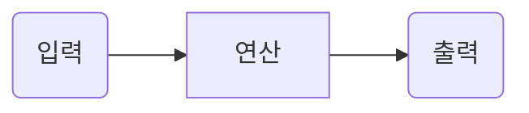

---

title: Practical Deep Learning for Coders

toc: true

use_math: true

categories:

 - Deep Learning

---

## 머신러닝은 무엇인가?

머신러닝은 일반적인 프로그래밍과 같이 컴퓨터가 특정 작업을 완성하는 방법을 알아내는 것이다. 그런데 일반적인 프로그래밍으로 우리가 이전에 강아지,고양이 분류기를 구현한 것처럼 어떻게 구현해야 하나? 아래에서 컴퓨터가 작업을 **완성**하기위해 필요한 스텝들을 적어놓겠다.

보통 우리가 프로그램을 구현할 때, 아래와 같이 절차를 적어놓고 구체적은 구현 단계에서 코드를 짜는 것이 

